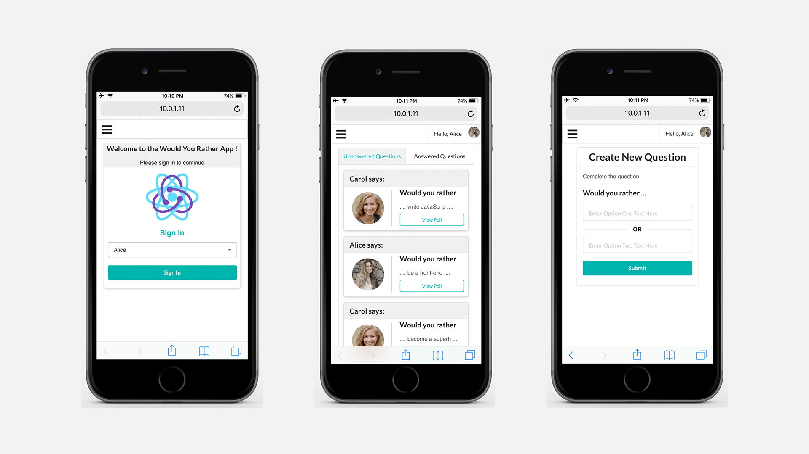
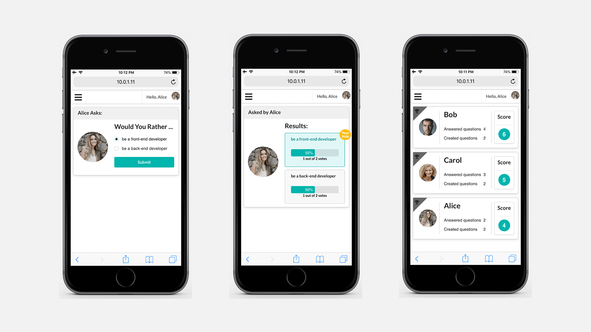
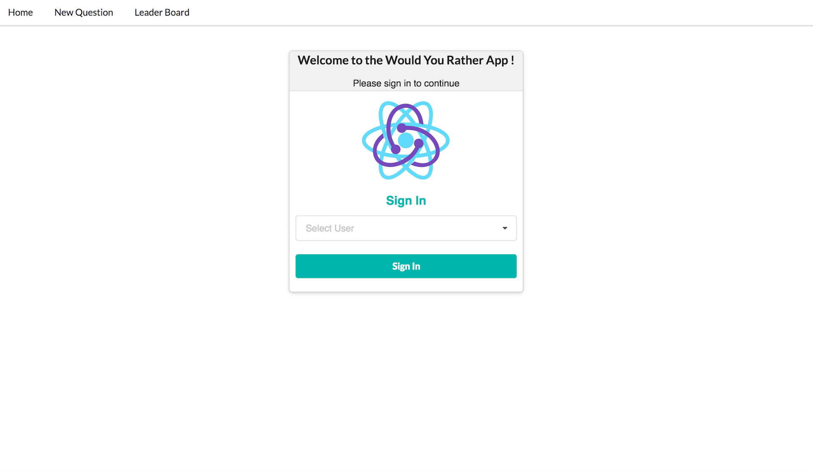
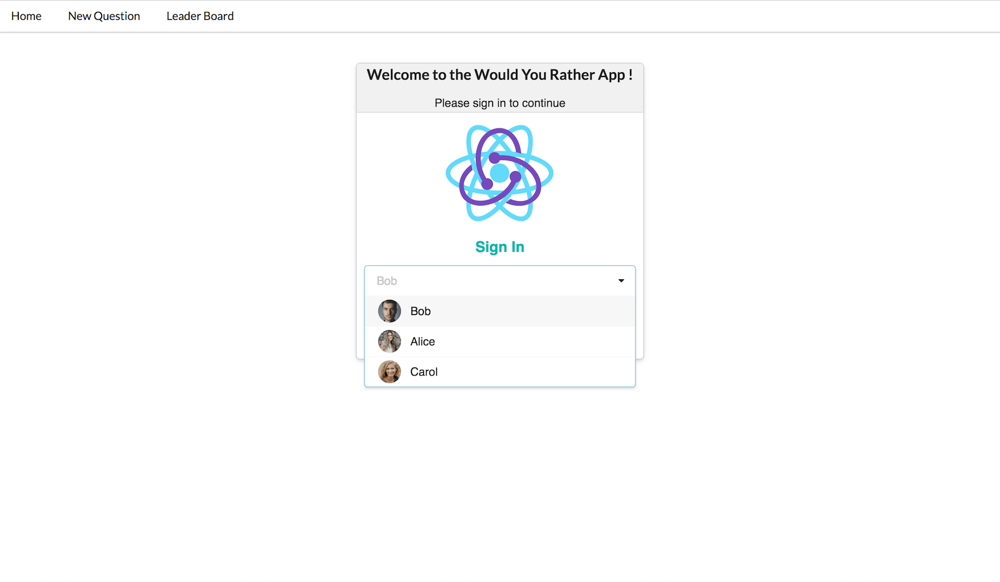
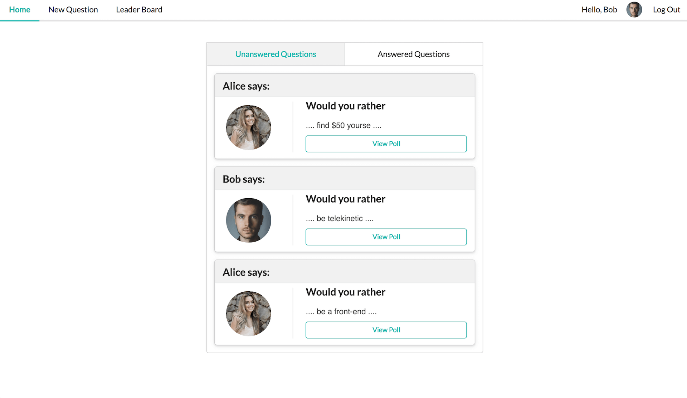
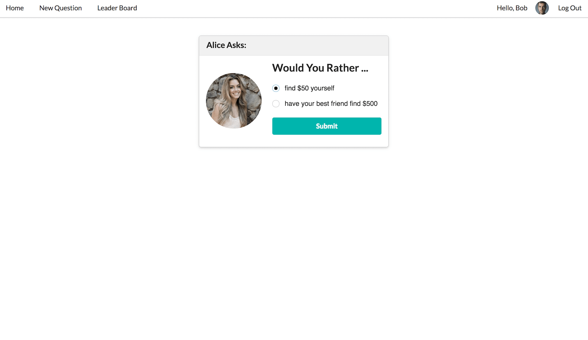
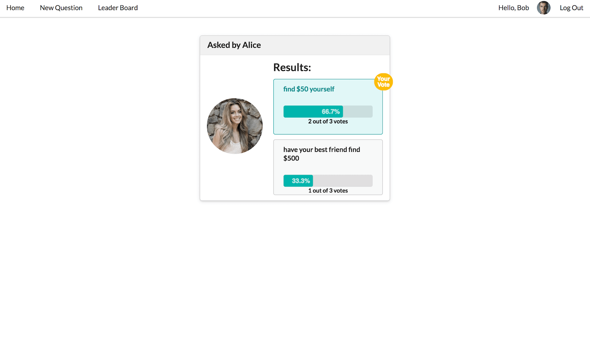
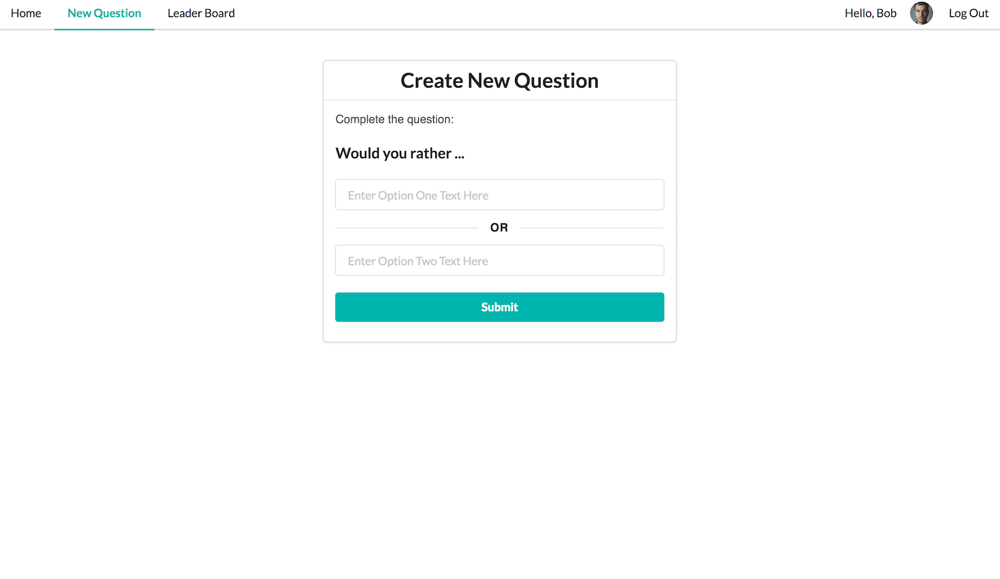
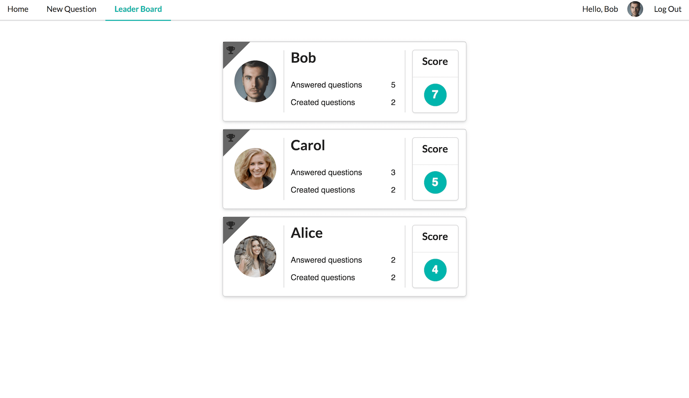

# Would You Rather: A Game developed using React & Redux

React & Redux Project — Udacity React Developer Nanodegree

This is the second project of the [React Developer Nanodegree](https://eu.udacity.com/course/react-nanodegree--nd019).

* [MyReads](https://github.com/planetpratik/MyReads) — React Fundamentals Project
* [Would You Rather](https://github.com/planetpratik/Would-You-Rather) — React & Redux Project

## Live Project:

You can run the firebase-hosted version of this app at (https://would-you-rather-redux.firebaseapp.com/)

## Project Purpose:

'Would You Rather' is a quiz based game which allows user to login, post questions and also vote on questions posted by other users. The project emphasizes using React & Redux to build the application. Redux store is used to persist information as we interact with the application.

## Project Review:

This project has been reviewed by the Udacity project evaluator. You can read the whole review [Here](https://review.udacity.com/#!/reviews/1348120/shared)




## How to Load the App

The project uses Node.js and the Create-React-App starter.  If you do not have Node >= 6.x installed, you can download it here: [Node.js](https://nodejs.org/en/)

Once Node is installed, navigate to the directory where you want to save the app
```sh
git clone https://github.com/planetpratik/Would-You-Rather
```
You can use ```npm``` or ```yarn``` package manager to install dependencies.
### ```npm install``` or ```yarn install```

Once all of the dependencies have been installed you can launch the development server with

### ```npm start```  or  ```yarn start```

A new browser window should automatically open displaying the app.  If it doesn't, navigate to [http://localhost:3000/](http://localhost:3000/) in your browser

## How to Use the App
### Login & Logout
Login page is the entry page for the app. User will be redirected to home path only after successful authentication. If user manually input the desired path, he/she will be asked to authenticate before redirecting it to desired path. If user is logged in, Logout button is displayed at the top-right corner which provides user ability to log out from the app and gets redirected to login screen.




### Navigation Bar
As the app is designed to run on mobile devices as well as desktop browsers, the horizontal menu items will be shrinked into Dropdown menu while using app on mobile browsers. When the user is logged in, avatar as well as welcome message is shown on the right side of the navigation bar.

### Home Screen
Home screen is available at `/` path. It displays feed of answered and unanswered questions. They are categorised in "Answered" and "Unanswered" tabs. They are arranged in decreasing order of their timestamp.



### Poll View
Poll Screen is available at `/questions/:question_id` path. It provides user ability to vote on poll ( only if Unanswered by user ) otherwise it shows the poll details page with vote percentage for each option.





### New Question
This form provides user ability to create new poll. It is available at `/add` path.



### Leaderboard
Leaderboard screen is available at `/leaderboard` path. It shows informational cards of all users arranged in the descending order of their score. The individual score is calculated as sum of total questions answered and total questions asked by user.



### Redux State
Using generated logs, Changes in the Redux state can be observed in browser console window.

## Data

The `_DATA.js` file represents a fake database and methods that let you access the data.
There are two types of objects stored in the database:

* Users
* Questions

### Users

Users include:

| Attribute    | Type             | Description           |
|-----------------|------------------|-------------------         |
| id                 | String           | The user’s unique identifier |
| name          | String           | The user’s first name  and last name     |
| avatarURL  | String           | The path to the image file |
| questions | Array | A list of ids of the polling questions this user created|
| answers      | Object         |  The object's keys are the ids of each question this user answered. The value of each key is the answer the user selected. It can be either `'optionOne'` or `'optionTwo'` since each question has two options.

### Questions

Questions include:

| Attribute | Type | Description |
|-----------------|------------------|-------------------|
| id                  | String | The question’s unique identifier |
| author        | String | The author’s unique identifier |
| timestamp | String | The time when the question was created|
| optionOne | Object | The first voting option|
| optionTwo | Object | The second voting option|

### Voting Options

Voting options are attached to questions. They include:

| Attribute | Type | Description |
|-----------------|------------------|-------------------|
| votes             | Array | A list that contains the id of each user who voted for that option|
| text                | String | The text of the option |

Your code will talk to the database via 4 methods:

* `_getUsers()`
* `_getQuestions()`
* `_saveQuestion(question)`
* `_saveQuestionAnswer(object)`

1) `_getUsers()` Method

*Description*: Get all of the existing users from the database.
*Return Value*: Object where the key is the user’s id and the value is the user object.

2) `_getQuestions()` Method

*Description*: Get all of the existing questions from the database.
*Return Value*: Object where the key is the question’s id and the value is the question object.

3) `_saveQuestion(question)` Method

*Description*: Save the polling question in the database.
*Parameters*:  Object that includes the following properties: `author`, `optionOneText`, and `optionTwoText`. More details about these properties:

| Attribute | Type | Description |
|-----------------|------------------|-------------------|
| author | String | The id of the user who posted the question|
| optionOneText| String | The text of the first option |
| optionTwoText | String | The text of the second option |

*Return Value*:  An object that has the following properties: `id`, `author`, `optionOne`, `optionTwo`, `timestamp`. More details about these properties:

| Attribute | Type | Description |
|-----------------|------------------|-------------------|
| id | String | The id of the question that was posted|
| author | String | The id of the user who posted the question|
| optionOne | Object | The object has a text property and a votes property, which stores an array of the ids of the users who voted for that option|
| optionTwo | Object | The object has a text property and a votes property, which stores an array of the ids of the users who voted for that option|
|timestamp|String | The time when the question was created|

4) `_saveQuestionAnswer(object)` Method

*Description*: Save the answer to a particular polling question in the database.
*Parameters*: Object that contains the following properties: `authedUser`, `qid`, and `answer`. More details about these properties:

| Attribute | Type | Description |
|-----------------|------------------|-------------------|
| authedUser | String | The id of the user who answered the question|
| qid | String | The id of the question that was answered|
| answer | String | The option the user selected. The value should be either `"optionOne"` or `"optionTwo"`|

### Resources and Documentation:
* [Create-react-app Documentation](https://github.com/facebook/create-react-app)
* [Redux Documentation](https://redux.js.org)
* [React Router Documentation](http://knowbody.github.io/react-router-docs/)
* [Official Semantic UI React Integration](https://react.semantic-ui.com/introduction)
* [Project starter template](https://github.com/udacity/reactnd-project-would-you-rather-starter)
* [Project Rubric](https://review.udacity.com/#!/rubrics/1567/view)
* [Royalty Free Photos - Pexels](https://www.pexels.com)
* [Marc Collado's Project Readme.md](https://github.com/MarcCollado/would-you-rather/blob/master/README.md)


## License:
MIT License

Copyright (c) 2018 Udacity, Pratik Chougule

Permission is hereby granted, free of charge, to any person obtaining a copy
of this software and associated documentation files (the "Software"), to deal
in the Software without restriction, including without limitation the rights
to use, copy, modify, merge, publish, distribute, sublicense, and/or sell
copies of the Software, and to permit persons to whom the Software is
furnished to do so, subject to the following conditions:

The above copyright notice and this permission notice shall be included in all
copies or substantial portions of the Software.

THE SOFTWARE IS PROVIDED "AS IS", WITHOUT WARRANTY OF ANY KIND, EXPRESS OR
IMPLIED, INCLUDING BUT NOT LIMITED TO THE WARRANTIES OF MERCHANTABILITY,
FITNESS FOR A PARTICULAR PURPOSE AND NONINFRINGEMENT. IN NO EVENT SHALL THE
AUTHORS OR COPYRIGHT HOLDERS BE LIABLE FOR ANY CLAIM, DAMAGES OR OTHER
LIABILITY, WHETHER IN AN ACTION OF CONTRACT, TORT OR OTHERWISE, ARISING FROM,
OUT OF OR IN CONNECTION WITH THE SOFTWARE OR THE USE OR OTHER DEALINGS IN THE
SOFTWARE.
